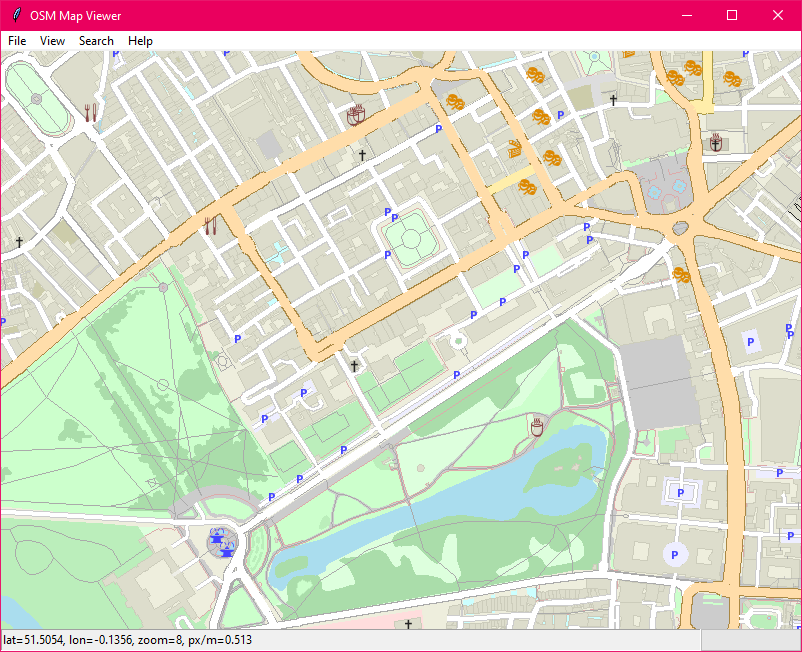
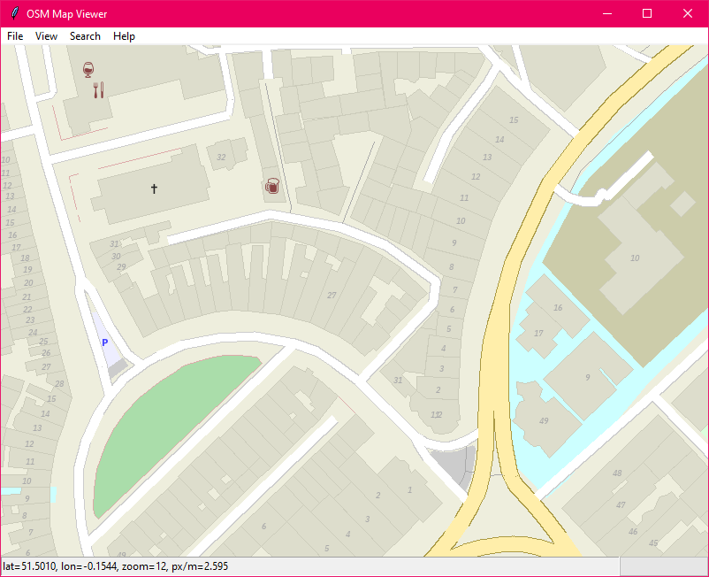
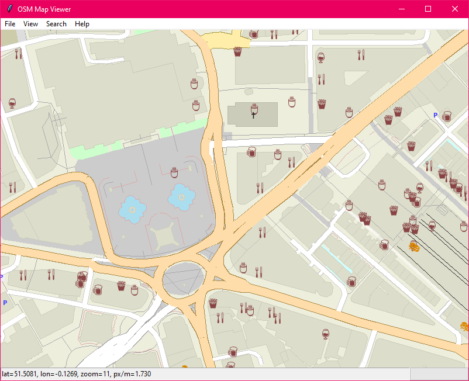
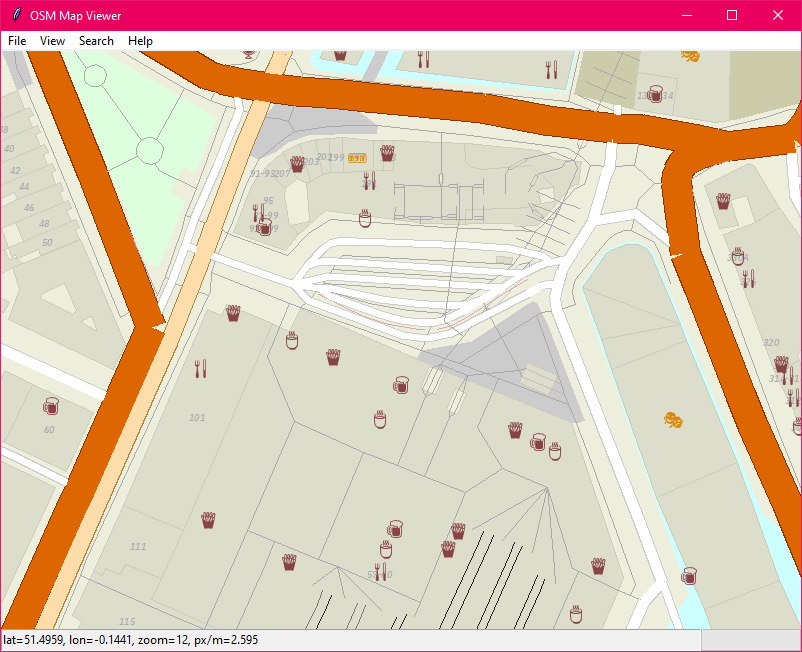

# OSM Map Viewer

This is a Python viewer for OpenStreetMap data made as part of a school project.

Requires Numpy and Pillow>=6.1.

To run, you must first collect all source files into a single directory, or add all source directories to `PYTHONPATH`.
You can use `assemble.py` to simplify this process (select the only file in each column and tick all check-boxes, then click on save).
Once this is done, run `gui.py`, making sure the current working directory is the project root (otherwise you will get font not found errors).
The project includes run configurations for PyCharm with a preconfigured `PYTHONPATH`.

## License

This project was made without any thought given to publishing it publicly, so the license situation is a bit complicated.
Not all files were authored by me (although I comitted them).
In general, all Python files, **except** `assemble.py` and all `test_*.py` files, were written by me, and are available under the terms of the Apache License 2.0, included in the `LICENSE` file.

Font files in `fonts/*` were obtained from their respective authors, and are bound by their respective terms.

Map data was obtained by exporting from [OpenStreetMap](https://www.openstreetmap.org/export) and are available under the [OpenStreetMap terms of use](https://wiki.osmfoundation.org/wiki/Terms_of_Use).

## Screenshots of London

 

